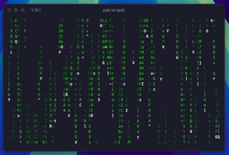

# termatrix

A terminal-based Matrix-like animation written in Go. It was just a bit of fun on an afternoon.

<p align="center">
  
</p>

## Installation

```bash
go install github.com/jyecusch/termatrix@latest
```

## Usage

```bash
termatrix
```

Press `q` to quit.

## Development

```bash
make run

make build
```
